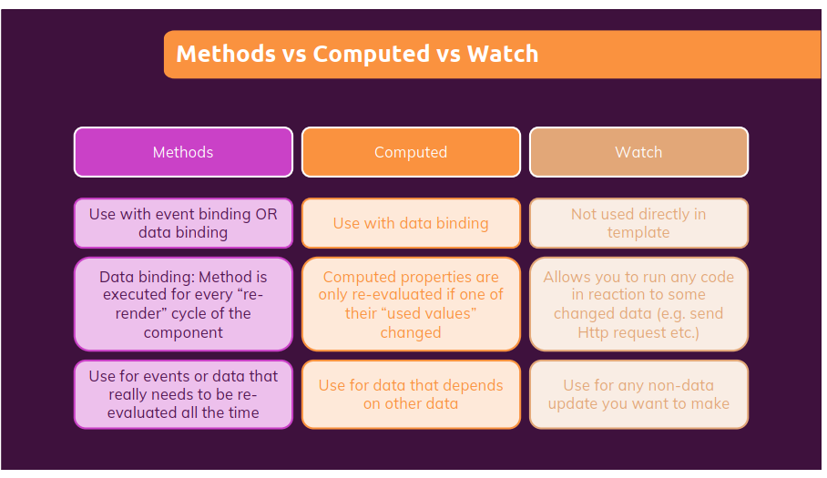

Phần này chúng ta sẽ tiếp tục tìm hiểu một số option: `watch`, `computed` và khái niệm thế nào là two-way binding trong Vuejs
***
## Outline
1. [Two-way binding](#Two-way binding)
2. [Computed property](#Computed-property)
3. [Watch property](#watch-property)
4. [References](#References)
***
### Two-way binding
Mình có một công thức như sau:
Two-way binding = Data binding + event Binding
- Data binding: như các ví dụ trước chúng ta đã làm, việc chúng ta tạo một biến và gán giá trị cho nó xong rồi interpolate nó trên html được gọi là data binding
- Event Binding: việc chúng ta dùng các sự kiện để thay đổi giá trị của biến, ví dụ bằng sự kiện click ta thay đổi giá trị counter, hành động này được gọ là event binding

Sự kết hợp của hai cái này được gọi là two-way binding, dễ hiểu đúng không?

Ví dụ: two-way binding with biến `name`
```javascript
<input type="text" :value="name" @input="setName($event)">
```

Tuy nhiên, Vue cũng cung cấp một keywork để giúp chúng ta đặt điều điều này bằng `v-mdoel`
```javascript
<input type="text" v-model="name">
```
Hai đoạn code trên là tương đương nhau, không có gì khác.
***
### Computed property
Như chúng ta đã biết với method được khái báo trong `methods` properties, khi chúng interpolate method đó trong html, nó sẽ gọi với mỗi re-render cycle mặc dù các biến trong method không thay đổi. Ví dụ nếu chúng ta thực hiện click on button add ở các ví dụ trước
```html
  <section id="events">
    <h2>Events in Action</h2>
    <button v-on:click="add">Add</button>
    <button v-on:click="reduce">Reduce</button>
    <p>Result: {{ counter }}</p>
    <p>{{ outputName() }}</p>
  </section>
```
```javascript
    add() {
      this.counter = this.counter + 1;
    },
    reduce() {
      this.counter = this.counter - 1;
      // this.counter--;
    },
    outputName() {
      console.log("AAAAAAAA");
    },
```

Chúng tha thực hiện event add, khi đó component sẽ được re-render lại, đồng nghĩa với với các biến và methods sẽ luôn được interpolate mặc dù chúng không hề thay đổi, điều này hạn chế ít nhiều đến hiệu năng của chương trình, đó là lí do `computed` ra đời.

Về cách sử dụng thì nó không khác method, chúng ta định nghĩa biến trong computed như sau:
```javascript
    computed: {
        fullName() {
            console.log('Running again...');
            if (this.name === '' || this.lastName === '') {
                return '';
            }
            return this.name + ' ' + this.lastName;
        },
    },
```
interpolate trong html
```html
<p>Your Name: {{ fullname }}</p>
```
Giờ đây chỉ khi nào các giá trị được sử dụng trong `fullName()` thì nó mới được gọi, nó sẽ không luôn gọi như trong `methods`
***
### Watch property
Một option property nữa watch, dùng cho việc để check logic và không dùng để return giá trị. Chúng ta phải đặt tên của watch giống với tên biến đã sử dụng trong `data` option, ở đây mình dùng watch để khởi tạo lại giá trị của biên counter khi vượt quá 50
```javascript
    watch: {
        counter(value) {
            console.log('counter: watch running...');
            // const that = this;
            if (value > 50) {
                // setTimeout(function () {
                //     that.counter = 0;
                // }, 2000);
                setTimeout(() => {
                    this.counter = 0;
                }, 2000);
            }
        },
    },
```
Tổng kết lại: sự giống và khác nhau giữa methods, computed, watch:



### References