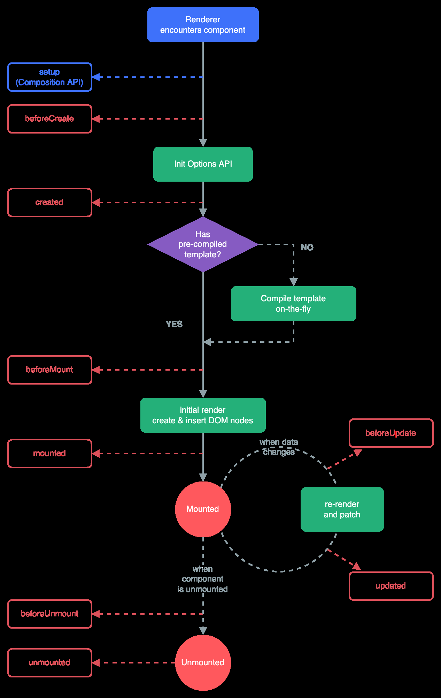

Chúng ta đã biết cách hiện thị giá trị của một biến trên html và thay đổi giá trị đó bằng một giá trị mới đồng thời cũng cập giá trị đó trên html từ khái niệm `v-model` hay `two-way binding` ở [bài 2](../2-basic-&-concepts). 

Ở bài này chúng ta sẽ đi sâu hơn một chút về cách mà Vuejs hoạt động & cũng tìm hiểu về khái niệm `Reactive` trong Vuejs. Cùng với đó là khái niệm về hook trong Vuejs

## Outline
1. [Javascript Proxies & Reactive Object in Vuejs](#Javascript-Proxies-&-Reactive-Object-in-Vuejs)
2. [Hooks in Vuejs](#Hooks-in-Vuejs)
***
### Javascript Proxies & Reactive Object in Vuejs
Mình sẽ không đi quá sâu và làm rõ Javascript vì đây là hướng dẫn về Vuejs. Trước khi xem `Reactive` nó là gì chúng ta sẽ cần hiểu về khái niệm Proxies trong Javascript.

Bắt đầu từ ví dụ sau:
```javascript
    let message = "Hello!";
    
    let longMessage = message + " World!";
    
    console.log(longMessage);
    
    message = "Hello !!!";
    
    console.log(longMessage);
```
*Nhận định:* 
- *Ví dụ này đơn giản vì vậy kết quả ai cũng biết giá trị của biến `longMessage` không thay đổi khi chúng ta thay đổi giá trị biến `message`*
- *Đem so sánh với Vuejs thì chúng ta thấy khác, ở Vuejs khi thay đổi giá trị thì nó sẽ tự động cập nhập vì mặc định nó là reactive object, còn javascipt thì không*

Vậy có cách nào để javascript biến object thành `'reactive object'`? Và `Proxies` đến và giúp chúng ta thực hiện điều đó.

Proxies object chó phép chúng ta can thiệp và thay đổi hành vi của một đối tượng, một số hành vi phổ biến như: `get`, `set`,...

Một Proxy bao gồm 2 tham số:
- target: đối tượng gốc
- handler: một object, dùng để can thiệp vào đối tượng gốc

Ví dụ
```javascript
const data = {
    message: 'Hello!',
    longMessgae: 'Hello!!! World!!!',
};

const handler = {
    set(target, key, value) {
        if (key === 'message') {
            target.longMessgae = value + ' World!!!';
        }
        target.message = value;
    },
};

// wrap this object with proxy in javascript
const proxy = new Proxy(data, handler);

// before
console.log(proxy.message);
console.log(proxy.longMessgae);
proxy.message = 'Hello !!!'; // three quetion marks
// afyer
console.log(proxy.message);
console.log(proxy.longMessgae);
```
Bằng cách dùng `Proxy` giá trị `longMessage` luôn được tự động cập nhập mỗi khi `messgae` bị thay đổi.

Chốt vấn đề:
- Vuejs mặc định các đối tượng là reactive (nó tự động thay đổi giá trị khi các thành phần cấu thành ra nó bị thay đổi)
- Javasciprt mặc định không reactive, muốn đặt được điều đó cần phải wrap đối tượng bằng `Proxy`
***
### Hooks in Vuejs
Ở [bài 2 phần 1](../2-basic-&-concepts/part1) chúng ta đã hiểu làm thế nào để Vuejs control được html và khái niệm single page application bằng cách kết nối một instance Vue với id của phần tử html bằng `mount`.

Trên thực tế, có thể tồn tại nhiều instance Vuejs trong một app và mỗi chúng nó sẽ chỉ quản lý một phần từ html(bao gồm cả các phần từ con trong đó) như ví dụ dưới đấy
<table>
<tr>
<td>index.html</td><td>app.js</td>
</tr>
<tr>
<td>

```html
<body>
  <header>
    <h1>Vue Behind The Scenes</h1>
  </header>
  <section id="app">
    <h2>How Vue Works</h2>
    <input type="text" ref="userText">
    <button @click="setText">Set Text</button>
    <p>{{ message }}</p>
  </section>

  <section id="app2">

  </section>
</body>
```
</td>
<td>

```javascript
const app2 = Vue.createApp({
    template: `
      <p>{{ favoriteMeal }}</p>
      <p>{{ favoriteMeal }}</p>
    `,

    data() {
        return {
            favoriteMeal: 'Pizza',
        };
    },

    methods: {},
});

app2.mount('#app2');
```
</td>
</tr>
</table>

Trong lifecycle của Vuejs thì `mount` còn được gọi là hook, nghĩa là nó là một giải đoạn trong quá trình tồn tại và mất đi của object và `mount` thuộc giai đoạn sinh ra dom (hiện thị trên html trên web page).

Chi tiết lifecycle object trong Vuejs:


Trong ảnh còn có `setup` đây là phần mới bổ sung của Vuejs, những phần mình viết từ đầu tới giờ được gọi là Option API và để hiểu được Composition API, thì cách tốt nhất là hiểu về Option API trước, vì nó có thể chuyển qua lại cho nhau. Đây là bảng tóm tắt

<table>
<tr>
<td>

**beforeCreate() hook**
</td>
<td>

Được gọi tự động khi khởi tạo một component, trước cả option như `data()` và `methods`. Nếu lúc này cố tình truy cập sẽ là `underfined`
</td>
</tr>
<tr>
<td>

**created() hook**
</td>
<td>

Được gọi tự động sau **beforeCreate() hook**, reactive data, computed properties, methods, và watchers đã được khởi tạo xong, tuy nhiên chưa được hiện thị trên webpage. Thông thường chúng ta có thể gọi api để lấy dữ liệu từ server tại đây
</td>
</tr>

<tr>
<td>

**beforeMount() hook**
</td>
<td>

Tiếp theo của giai đoạn trên, tại trạng thái này component đã hoàn tất quá trình khởi tạo của mình. Tuy nhiên DOM note vẫn chưa được tạo
</td>
</tr>

<tr>
<td>

**Mount() hook**
</td>
<td>

Việc chúng ta mount app như tất cả các ví dụ trước chúng ta làm diễn ra ở đây
</td>
</tr>

<tr>
<td>

**beforeUpdate() hook**
</td>
<td>
Tiếp theo của giai đoạn trên. Vì mặc định Vuejs là reactive object, hook này giúp chúng ta truy cập các giá trị trước khi bị thay đổi
</td>
</tr>

<tr>
<td>

**update() hook**
</td>
<td>

Tiếp theo, trạng thái và chúng ta vẫn thao tác từ trước đến giờ, đó là chỉ quan tâm và thấy giá trị bị thay đổi sau khi update
</td>
</tr>

<tr>
<td>

**beforeUnmount() hook**
</td>
<td>

...
</td>
</tr>

<tr>
<td>

**unmounted() hook**
</td>
<td>

Một component là unmounted nếu:
- Tất cả các component con của nó unmounted
- Tất cả các reactive effect (computed, watcher) bị chấm dứt
</td>
</tr>
</table>

Bài cũng đà dài nên mình dừng ở đây. Tất cả các code mình để ở [đây](./behind-scenes-01-starting-setup)

Summary:
- Chúng ta đã hiểu về reactive và khái niệm Proxy trong javascript
- Lifecycle và hooks trong Vuejs
***
### References
- [Proxy](https://developer.mozilla.org/en-US/docs/Web/JavaScript/Reference/Global_Objects/Proxy)
- [Lifecycle Hooks](https://vuejs.org/guide/essentials/lifecycle.html)